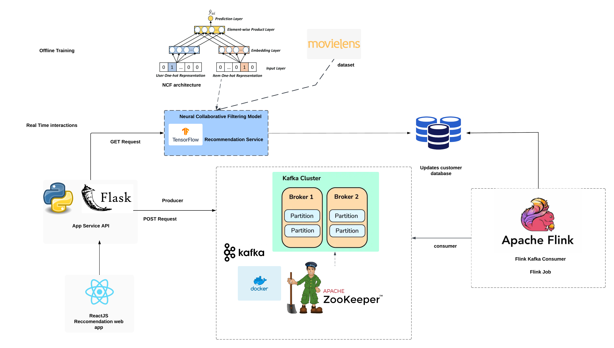

# 🎬 Movie Recommender System

A hybrid batch + real-time movie recommender built with **TensorFlow**, **Kafka**, **Flink**, and **Flask**. The project integrates offline Neural Collaborative Filtering (NCF) model training with real-time user interaction streaming using Apache Kafka and Apache Flink. Offline training ensures robust and accurate recommendations, while the streaming pipeline continuously captures user clicks and preferences, enabling the system to adapt and improve over time. A Flask-based REST API exposes endpoints for fetching recommendations and logging user feedback, and a React frontend provides a simple interface for users to interact with the system. The entire setup is containerized using Docker for reproducibility and easy deployment.


<p align="left">
  
  
  
  
  
  
  
</p>

## Table of Contents

* [System Architecture](#system-architecture)
* [Features](#features)
* [Tech Stack](#tech-stack)
* [Project Structure](#project-structure)
* [Data](#data)
* [Installation](#installation)
* [Future Work](#future-work)
* [Contributors](#contributors)

## System Architecture



The system architecture is designed as a hybrid recommendation pipeline that integrates both offline training and real-time user feedback. A React.js web application acts as the front-end, enabling users to log in and request personalized movie recommendations. These requests are handled by a Flask-based Python API, which exposes two main endpoints — a GET request to fetch recommendations and a POST request to capture user clicks and feedback. The API leverages a TensorFlow-based Neural Collaborative Filtering (NCF) model, trained offline on the MovieLens dataset, to generate personalized predictions. To incorporate real-time behavior, all click interactions are published to a Kafka cluster (orchestrated with Docker and Zookeeper), ensuring reliable event streaming. These events are then consumed by Apache Flink, which processes the user interactions and stores them into a persistent database (in this implementation, CSV files). Before serving final recommendations, the NCF model checks against this stored feedback to avoid recommending already consumed items and to make more informed predictions. This architecture ensures a balance of robust offline accuracy and adaptive real-time learning for continuous improvement of recommendations.

## Features

* **Personalized Recommendations**: Uses a Neural Collaborative Filtering (NCF) model trained on the MovieLens dataset to generate top-N movie suggestions tailored to each user.

* **Cold-Start Handling**: Provides a popularity-based fallback mechanism for new or anonymous users, ensuring meaningful recommendations even without prior history.

* **REST API Endpoints**: Flask API exposes:

  * `GET /predict/<user_id>` → Fetch top-10 personalized or popularity-based recommendations.
  * `POST /click` → Capture user interactions (clicks/likes) in real time.
  * `GET /debug` → Health check and service information.

* **Real-Time Event Streaming**: User interactions are logged and streamed through **Apache Kafka**, enabling asynchronous decoupling between API and processing pipeline.

* **Stream Processing with Flink**: An **Apache Flink job** consumes Kafka events, processes them, and stores structured interaction data into a persistent format (CSV in this implementation).

* **Feedback-Aware Predictions**: Before generating new recommendations, the system checks stored interaction history to avoid recommending already watched or liked items.

* **Containerized Infrastructure**: Kafka and Zookeeper are containerized with **Docker**, ensuring reproducible, portable deployment across environments.

* **Frontend Integration**: A simple **React.js application** serves as the UI for login and displaying recommendations, connecting seamlessly to the Flask API.

* **Scalable Design**: The architecture is modular and can scale horizontally — the training pipeline, API service, Kafka brokers, and Flink jobs can all be scaled independently.

## 🛠️ Tech Stack

<p align="left">
  
  
  
  
  
  
  
</p>

* **Programming Language**: Python (3.9+)
* **Machine Learning**: TensorFlow/Keras, Scikit-learn
* **Data Processing**: Pandas, NumPy, Joblib
* **Web Framework**: Flask (REST API)
* **Frontend**: React.js
* **Event Streaming**: Apache Kafka + Zookeeper
* **Stream Processing**: Apache Flink (PyFlink)
* **Containerization**: Docker, Docker Compose
* **Visualization**: Matplotlib

## 📂 Project Structure

```
movie-recommender-system/
│
├── assets/                     # Images, architecture diagrams, documentation assets
│
├── frontend/                   # React frontend for login and movie recommendations
│   ├── App.jsx                 # Main React component
│   ├── api.js                  # API calls to Flask backend
│
├── kafka-stack/                # Kafka + Zookeeper setup
│   ├── docker-compose.yml      # Docker setup for Kafka and Zookeeper
│
├── model/                      # Trained models and artifacts
│   ├── ncf_model.keras
│   ├── neural_cf_model.keras
│   ├── neural_cf_residual.keras
│   ├── user2idx.pkl
│   ├── movie2idx.pkl
│   ├── user_scaler.pkl
│   ├── movie_scaler.pkl
│   ├── training_history.png
│   ├── ncf_training_history.png
│
├── src/                        # Core Python source files
│   ├── data_preprocessor.py    # Preprocesses MovieLens dataset into feature sets
│   ├── train_model.py          # Baseline NCF model training
│   ├── train_model_v2.py       # Advanced NCF model with additional features
│   ├── model_service_ncf.py    # Flask API for serving recommendations
│   ├── flink_job.py            # Flink job for consuming Kafka events
│
├── docker-commands.txt         # Manual Docker commands reference
├── requirements.txt            # Python dependencies
├── .gitignore                  # Git ignore rules
└── README.md                   # Project documentation
```

## Data

This project uses the **MovieLens dataset**, a popular benchmark dataset for recommendation systems.

* **Raw Data (in `data/raw/`)**:

  * `movies.csv` → Movie metadata (movieId, title, genres)
  * `ratings.csv` → User ratings (userId, movieId, rating, timestamp)
* **Processed Data (in `data/processed/`)**:

  * `movie_features.csv` → Engineered features for movies (release year, average rating, genres one-hot encoding)
  * `user_features.csv` → Aggregated user features (average ratings per genre, user averages)

The dataset can be downloaded from the following link:
➡️ [Download MovieLens Dataset](https://drive.google.com/drive/folders/1006X53vGZTGSDGaRKqxluUbT1sMP8EUU?usp=sharing)

This dataset is used for both **offline training** of the Neural Collaborative Filtering (NCF) model and for **real-time evaluation** with user interactions.


## ⚙️ Installation

Follow these steps to set up the project locally. This guide assumes you have **Git**, **Python 3.9+**, and **Docker** installed.

### 1. Clone the Repository

```bash
git clone https://github.com/arkya-art/movie-recommender-system.git
cd movie-recommender-system
```

### 2. Create a Virtual Environment & Install Dependencies

```bash
python3 -m venv venv
source venv/bin/activate   # Linux/Mac
venv\Scripts\activate      # Windows

pip install -r requirements.txt
```

### 3. Install Docker

* Download and install Docker from [Docker official site](https://docs.docker.com/get-docker/).
* Verify installation:

```bash
docker --version
```

### 4. Start Kafka & Zookeeper with Docker Compose

The repository includes a `docker-compose.yml` file to run Kafka and Zookeeper.

```bash
docker-compose up -d
```

* Check if containers are running:

```bash
docker ps
```

You should see two containers: `my-zookeeper` and `my-kafka` running.

### 5. Preprocess Data (Optional)

If you want to **train the NCF model from scratch**:

```bash
python data_preprocessor.py
python train_model_v2.py
```

If you only want to run the system with the pre-trained model, skip this step. A trained model is already included in the `model/` folder for inference.

### 6. Start the Flask API Service

This service loads the trained NCF model and exposes endpoints.

```bash
python model_service_ncf.py
```

API will start at: [http://localhost:5002](http://localhost:5002)

### 7. Run the Flink Streaming Job

Make sure you have PyFlink installed. Then run:

```bash
python flink_job.py
```

This job will consume user click events from Kafka and store them into CSV files.

### 8. Interact with the System

* **Get Recommendations:**

```bash
curl http://localhost:5002/predict/1
```

* **Send User Interaction (Click):**

```bash
curl -X POST http://localhost:5002/click \
     -H "Content-Type: application/json" \
     -d '{"userId": 1, "movieId": 10, "timestamp": 1694582374}'
```

* **Check API Status:**

```bash
curl http://localhost:5002/debug
```

### 9. Frontend (Optional)

Navigate into the `frontend/` directory and run:

```bash
npm install
npm start
```

This launches a React-based UI to interact with the recommender system visually.

## Future Work

While the current system demonstrates the integration of batch training and real-time processing, several enhancements can make it more powerful and production-ready

* **Advanced Stream Processing**: Extend the Flink job to include stateful processing, session tracking, and trend analysis for adaptive recommendations.
* **Online Model Updates**: Implement online learning or incremental retraining so that the NCF model adapts quickly to new interactions.
* **Better Cold-Start Solutions**: Incorporate content-based features (genres, metadata, demographics) to handle new users/items more effectively.
* **Experimentation Framework**: Add A/B testing for evaluating different recommendation strategies and configurations.
* **User Interface Improvements**: Build a more interactive and feature-rich frontend with personalized dashboards.
* **Database Integration**: Replace CSV-based storage with scalable databases (e.g., PostgreSQL, MongoDB, or Cassandra) for persistence and querying.
* **Deployment Automation**: Use Kubernetes or cloud services to orchestrate containers, manage scaling, and streamline CI/CD pipelines.

---

## Contributors

* **Arkya Bagchi** 
* **Raskar Varun** 

